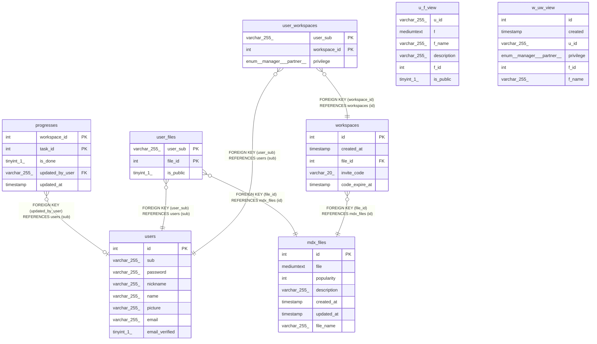

# checkdown_db

## Tables

| Name | Columns | Comment | Type |
| ---- | ------- | ------- | ---- |
| [mdx_files](mdx_files.md) | 7 |  | BASE TABLE |
| [progresses](progresses.md) | 5 |  | BASE TABLE |
| [u_f_view](u_f_view.md) | 6 | VIEW | VIEW |
| [user_files](user_files.md) | 3 |  | BASE TABLE |
| [user_workspaces](user_workspaces.md) | 3 |  | BASE TABLE |
| [users](users.md) | 8 |  | BASE TABLE |
| [w_uw_view](w_uw_view.md) | 6 | VIEW | VIEW |
| [workspaces](workspaces.md) | 5 |  | BASE TABLE |

## Relations

---

> Generated by [tbls](https://github.com/k1LoW/tbls)
