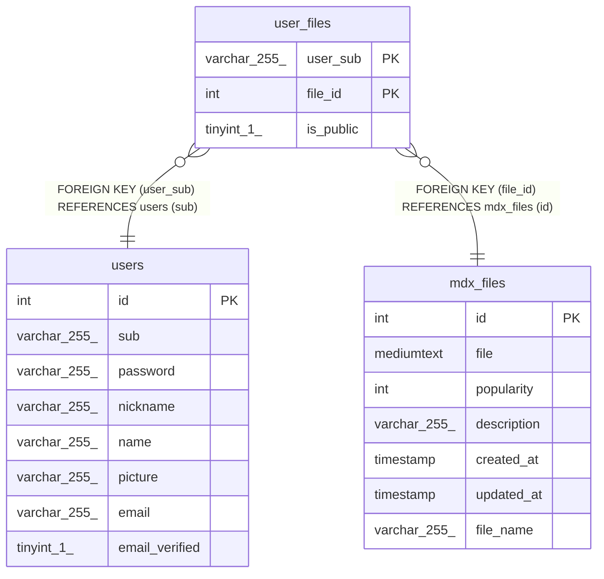

# user_files

## Description

<details>
<summary><strong>Table Definition</strong></summary>

```sql
CREATE TABLE `user_files` (
  `user_sub` varchar(255) COLLATE utf8mb4_general_ci NOT NULL,
  `file_id` int NOT NULL,
  `is_public` tinyint(1) DEFAULT '0',
  PRIMARY KEY (`user_sub`,`file_id`),
  KEY `file_id` (`file_id`),
  CONSTRAINT `user_files_ibfk_1` FOREIGN KEY (`user_sub`) REFERENCES `users` (`sub`),
  CONSTRAINT `user_files_ibfk_2` FOREIGN KEY (`file_id`) REFERENCES `mdx_files` (`id`)
) ENGINE=InnoDB DEFAULT CHARSET=utf8mb4 COLLATE=utf8mb4_general_ci
```

</details>

## Columns

| Name | Type | Default | Nullable | Children | Parents | Comment |
| ---- | ---- | ------- | -------- | -------- | ------- | ------- |
| user_sub | varchar(255) |  | false |  | [users](users.md) |  |
| file_id | int |  | false |  | [mdx_files](mdx_files.md) |  |
| is_public | tinyint(1) | 0 | true |  |  |  |

## Constraints

| Name | Type | Definition |
| ---- | ---- | ---------- |
| PRIMARY | PRIMARY KEY | PRIMARY KEY (user_sub, file_id) |
| user_files_ibfk_1 | FOREIGN KEY | FOREIGN KEY (user_sub) REFERENCES users (sub) |
| user_files_ibfk_2 | FOREIGN KEY | FOREIGN KEY (file_id) REFERENCES mdx_files (id) |

## Indexes

| Name | Definition |
| ---- | ---------- |
| file_id | KEY file_id (file_id) USING BTREE |
| PRIMARY | PRIMARY KEY (user_sub, file_id) USING BTREE |

## Relations



---

> Generated by [tbls](https://github.com/k1LoW/tbls)
