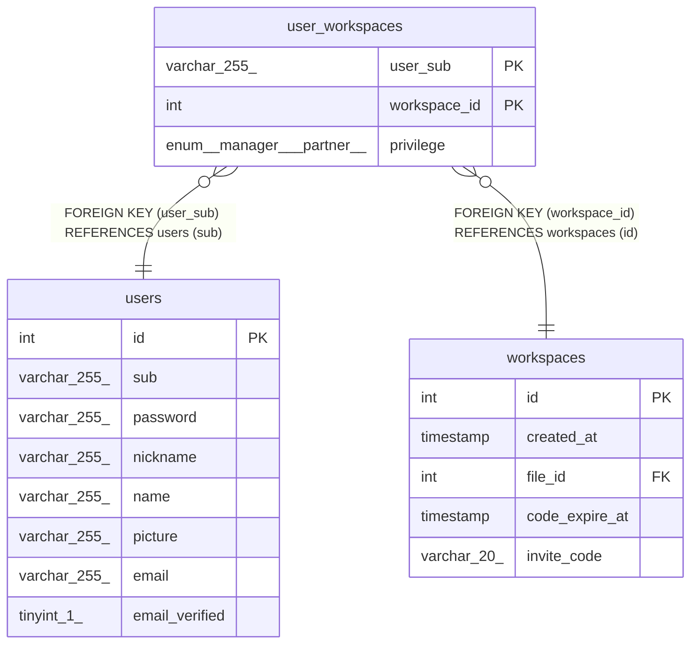

# user_workspaces

## Description

<details>
<summary><strong>Table Definition</strong></summary>

```sql
CREATE TABLE `user_workspaces` (
  `user_sub` varchar(255) COLLATE utf8mb4_general_ci NOT NULL,
  `workspace_id` int NOT NULL,
  `privilege` enum('manager','partner') COLLATE utf8mb4_general_ci DEFAULT 'partner',
  PRIMARY KEY (`user_sub`,`workspace_id`),
  KEY `workspace_id` (`workspace_id`),
  CONSTRAINT `user_workspaces_ibfk_1` FOREIGN KEY (`user_sub`) REFERENCES `users` (`sub`),
  CONSTRAINT `user_workspaces_ibfk_2` FOREIGN KEY (`workspace_id`) REFERENCES `workspaces` (`id`)
) ENGINE=InnoDB DEFAULT CHARSET=utf8mb4 COLLATE=utf8mb4_general_ci
```

</details>

## Columns

| Name | Type | Default | Nullable | Children | Parents | Comment |
| ---- | ---- | ------- | -------- | -------- | ------- | ------- |
| user_sub | varchar(255) |  | false |  | [users](users.md) |  |
| workspace_id | int |  | false |  | [workspaces](workspaces.md) |  |
| privilege | enum('manager','partner') | partner | true |  |  |  |

## Constraints

| Name | Type | Definition |
| ---- | ---- | ---------- |
| PRIMARY | PRIMARY KEY | PRIMARY KEY (user_sub, workspace_id) |
| user_workspaces_ibfk_1 | FOREIGN KEY | FOREIGN KEY (user_sub) REFERENCES users (sub) |
| user_workspaces_ibfk_2 | FOREIGN KEY | FOREIGN KEY (workspace_id) REFERENCES workspaces (id) |

## Indexes

| Name | Definition |
| ---- | ---------- |
| workspace_id | KEY workspace_id (workspace_id) USING BTREE |
| PRIMARY | PRIMARY KEY (user_sub, workspace_id) USING BTREE |

## Relations



---

> Generated by [tbls](https://github.com/k1LoW/tbls)
