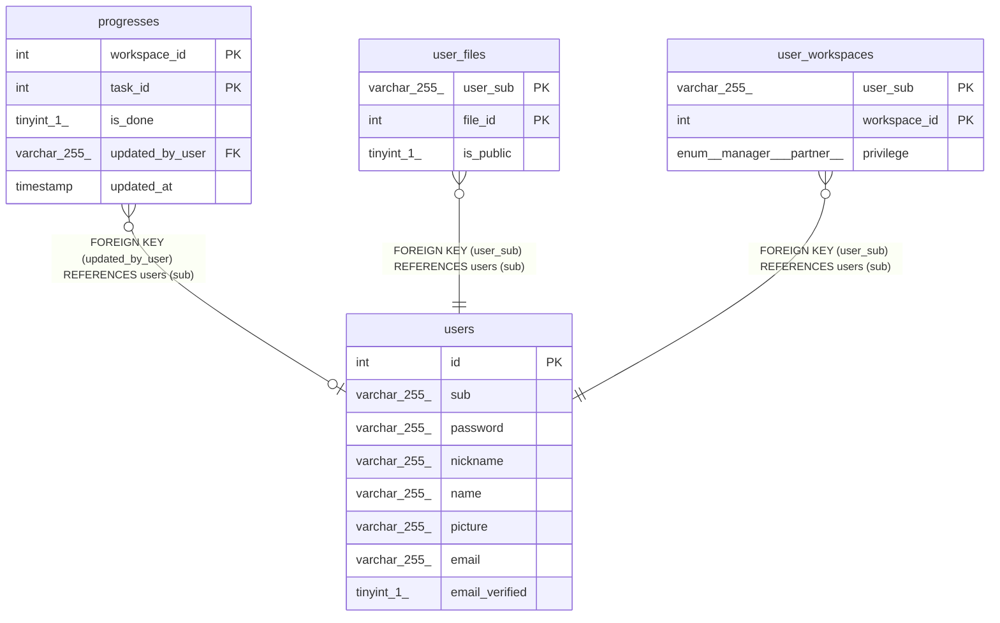

# users

## Description

<details>
<summary><strong>Table Definition</strong></summary>

```sql
CREATE TABLE `users` (
  `id` int NOT NULL AUTO_INCREMENT,
  `sub` varchar(255) COLLATE utf8mb4_general_ci NOT NULL,
  `password` varchar(255) COLLATE utf8mb4_general_ci DEFAULT NULL,
  `nickname` varchar(255) COLLATE utf8mb4_general_ci DEFAULT NULL,
  `name` varchar(255) COLLATE utf8mb4_general_ci DEFAULT NULL,
  `picture` varchar(255) COLLATE utf8mb4_general_ci DEFAULT NULL,
  `email` varchar(255) COLLATE utf8mb4_general_ci DEFAULT NULL,
  `email_verified` tinyint(1) DEFAULT '0',
  PRIMARY KEY (`id`),
  UNIQUE KEY `sub` (`sub`)
) ENGINE=InnoDB AUTO_INCREMENT=[Redacted by tbls] DEFAULT CHARSET=utf8mb4 COLLATE=utf8mb4_general_ci
```

</details>

## Columns

| Name | Type | Default | Nullable | Extra Definition | Children | Parents | Comment |
| ---- | ---- | ------- | -------- | ---------------- | -------- | ------- | ------- |
| id | int |  | false | auto_increment |  |  |  |
| sub | varchar(255) |  | false |  | [progresses](progresses.md) [user_files](user_files.md) [user_workspaces](user_workspaces.md) |  |  |
| password | varchar(255) |  | true |  |  |  |  |
| nickname | varchar(255) |  | true |  |  |  |  |
| name | varchar(255) |  | true |  |  |  |  |
| picture | varchar(255) |  | true |  |  |  |  |
| email | varchar(255) |  | true |  |  |  |  |
| email_verified | tinyint(1) | 0 | true |  |  |  |  |

## Constraints

| Name | Type | Definition |
| ---- | ---- | ---------- |
| PRIMARY | PRIMARY KEY | PRIMARY KEY (id) |
| sub | UNIQUE | UNIQUE KEY sub (sub) |

## Indexes

| Name | Definition |
| ---- | ---------- |
| PRIMARY | PRIMARY KEY (id) USING BTREE |
| sub | UNIQUE KEY sub (sub) USING BTREE |

## Relations



---

> Generated by [tbls](https://github.com/k1LoW/tbls)
