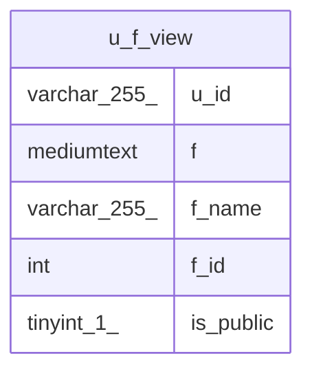

# u_f_view

## Description

VIEW

<details>
<summary><strong>Table Definition</strong></summary>

```sql
CREATE VIEW u_f_view AS (select `u`.`user_sub` AS `u_id`,`m`.`file` AS `f`,`m`.`file_name` AS `f_name`,`m`.`id` AS `f_id`,`u`.`is_public` AS `is_public` from (`checkdown_db`.`user_files` `u` join `checkdown_db`.`mdx_files` `m` on((`u`.`file_id` = `m`.`id`))))
```

</details>

## Columns

| Name | Type | Default | Nullable | Children | Parents | Comment |
| ---- | ---- | ------- | -------- | -------- | ------- | ------- |
| u_id | varchar(255) |  | false |  |  |  |
| f | mediumtext |  | false |  |  |  |
| f_name | varchar(255) |  | false |  |  |  |
| f_id | int | 0 | false |  |  |  |
| is_public | tinyint(1) | 0 | true |  |  |  |

## Referenced Tables

| Name | Columns | Comment | Type |
| ---- | ------- | ------- | ---- |
| [user_files](user_files.md) | 3 |  | BASE TABLE |
| [mdx_files](mdx_files.md) | 5 |  | BASE TABLE |

## Relations



---

> Generated by [tbls](https://github.com/k1LoW/tbls)
