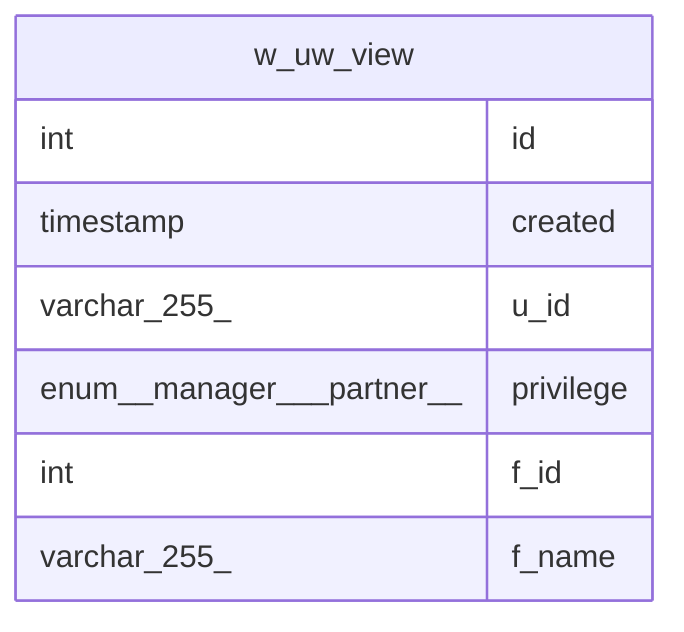

# w_uw_view

## Description

VIEW

<details>
<summary><strong>Table Definition</strong></summary>

```sql
CREATE VIEW w_uw_view AS (select `w`.`id` AS `id`,`w`.`created_at` AS `created`,`uw`.`user_sub` AS `u_id`,`uw`.`privilege` AS `privilege`,`w`.`file_id` AS `f_id`,`m`.`file_name` AS `f_name` from ((`checkdown_db`.`workspaces` `w` join `checkdown_db`.`user_workspaces` `uw` on((`w`.`id` = `uw`.`workspace_id`))) join `checkdown_db`.`mdx_files` `m` on((`w`.`file_id` = `m`.`id`))))
```

</details>

## Columns

| Name | Type | Default | Nullable | Extra Definition | Children | Parents | Comment |
| ---- | ---- | ------- | -------- | ---------------- | -------- | ------- | ------- |
| id | int | 0 | false |  |  |  |  |
| created | timestamp | CURRENT_TIMESTAMP | true | DEFAULT_GENERATED |  |  |  |
| u_id | varchar(255) |  | false |  |  |  |  |
| privilege | enum('manager','partner') | partner | true |  |  |  |  |
| f_id | int |  | false |  |  |  |  |
| f_name | varchar(255) |  | false |  |  |  |  |

## Referenced Tables

| Name | Columns | Comment | Type |
| ---- | ------- | ------- | ---- |
| [workspaces](workspaces.md) | 5 |  | BASE TABLE |
| [user_workspaces](user_workspaces.md) | 3 |  | BASE TABLE |
| [mdx_files](mdx_files.md) | 5 |  | BASE TABLE |

## Relations



---

> Generated by [tbls](https://github.com/k1LoW/tbls)
