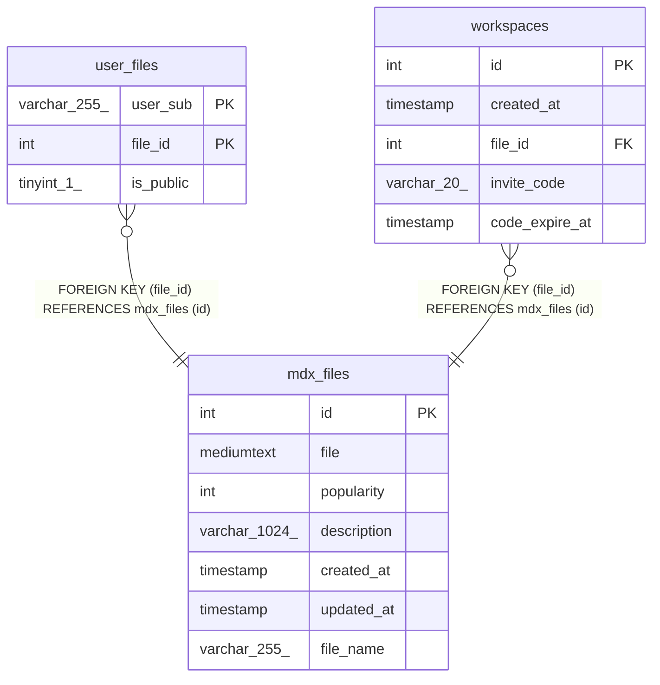

# mdx_files

## Description

<details>
<summary><strong>Table Definition</strong></summary>

```sql
CREATE TABLE `mdx_files` (
  `id` int NOT NULL AUTO_INCREMENT,
  `file` mediumtext COLLATE utf8mb4_general_ci NOT NULL,
  `popularity` int DEFAULT '0',
  `description` varchar(1024) COLLATE utf8mb4_general_ci DEFAULT NULL,
  `created_at` timestamp NULL DEFAULT CURRENT_TIMESTAMP,
  `updated_at` timestamp NULL DEFAULT CURRENT_TIMESTAMP ON UPDATE CURRENT_TIMESTAMP,
  `file_name` varchar(255) COLLATE utf8mb4_general_ci NOT NULL,
  PRIMARY KEY (`id`),
  FULLTEXT KEY `file_name` (`file_name`)
) ENGINE=InnoDB DEFAULT CHARSET=utf8mb4 COLLATE=utf8mb4_general_ci
```

</details>

## Columns

| Name | Type | Default | Nullable | Extra Definition | Children | Parents | Comment |
| ---- | ---- | ------- | -------- | ---------------- | -------- | ------- | ------- |
| id | int |  | false | auto_increment | [user_files](user_files.md) [workspaces](workspaces.md) |  |  |
| file | mediumtext |  | false |  |  |  |  |
| popularity | int | 0 | true |  |  |  |  |
| description | varchar(1024) |  | true |  |  |  |  |
| created_at | timestamp | CURRENT_TIMESTAMP | true | DEFAULT_GENERATED |  |  |  |
| updated_at | timestamp | CURRENT_TIMESTAMP | true | DEFAULT_GENERATED on update CURRENT_TIMESTAMP |  |  |  |
| file_name | varchar(255) |  | false |  |  |  |  |

## Constraints

| Name | Type | Definition |
| ---- | ---- | ---------- |
| PRIMARY | PRIMARY KEY | PRIMARY KEY (id) |

## Indexes

| Name | Definition |
| ---- | ---------- |
| file_name | KEY file_name (file_name) USING FULLTEXT |
| PRIMARY | PRIMARY KEY (id) USING BTREE |

## Relations



---

> Generated by [tbls](https://github.com/k1LoW/tbls)
