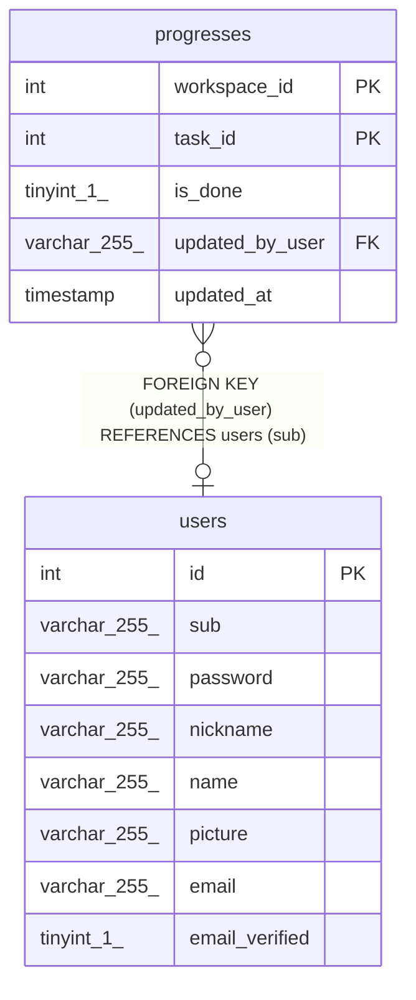

# progresses

## Description

<details>
<summary><strong>Table Definition</strong></summary>

```sql
CREATE TABLE `progresses` (
  `workspace_id` int NOT NULL,
  `task_id` int NOT NULL,
  `is_done` tinyint(1) DEFAULT '0',
  `updated_by_user` varchar(255) COLLATE utf8mb4_general_ci DEFAULT NULL,
  `updated_at` timestamp NULL DEFAULT CURRENT_TIMESTAMP ON UPDATE CURRENT_TIMESTAMP,
  PRIMARY KEY (`workspace_id`,`task_id`),
  KEY `updated_by_user` (`updated_by_user`),
  CONSTRAINT `progresses_ibfk_1` FOREIGN KEY (`updated_by_user`) REFERENCES `users` (`sub`)
) ENGINE=InnoDB DEFAULT CHARSET=utf8mb4 COLLATE=utf8mb4_general_ci
```

</details>

## Columns

| Name | Type | Default | Nullable | Extra Definition | Children | Parents | Comment |
| ---- | ---- | ------- | -------- | ---------------- | -------- | ------- | ------- |
| workspace_id | int |  | false |  |  |  |  |
| task_id | int |  | false |  |  |  |  |
| is_done | tinyint(1) | 0 | true |  |  |  |  |
| updated_by_user | varchar(255) |  | true |  |  | [users](users.md) |  |
| updated_at | timestamp | CURRENT_TIMESTAMP | true | DEFAULT_GENERATED on update CURRENT_TIMESTAMP |  |  |  |

## Constraints

| Name | Type | Definition |
| ---- | ---- | ---------- |
| PRIMARY | PRIMARY KEY | PRIMARY KEY (workspace_id, task_id) |
| progresses_ibfk_1 | FOREIGN KEY | FOREIGN KEY (updated_by_user) REFERENCES users (sub) |

## Indexes

| Name | Definition |
| ---- | ---------- |
| updated_by_user | KEY updated_by_user (updated_by_user) USING BTREE |
| PRIMARY | PRIMARY KEY (workspace_id, task_id) USING BTREE |

## Triggers

| Name | Definition |
| ---- | ---------- |
| check_user_access | CREATE TRIGGER check_user_access BEFORE INSERT ON progresses<br>FOR EACH ROW<br>BEGIN<br>    DECLARE user_access INT;<br>    SELECT COUNT(*) INTO user_access<br>    FROM user_workspaces<br>    WHERE user_sub = NEW.updated_by_user AND workspace_id = NEW.workspace_id;<br>    IF user_access = 0 THEN<br>        SIGNAL SQLSTATE '45000' SET MESSAGE_TEXT = 'User does not have access to this workspace';<br>    END IF;<br>END |
| check_user_access_update | CREATE TRIGGER check_user_access_update BEFORE UPDATE ON progresses<br>FOR EACH ROW<br>BEGIN<br>    DECLARE user_access INT;<br>    SELECT COUNT(*) INTO user_access<br>    FROM user_workspaces<br>    WHERE user_sub = NEW.updated_by_user AND workspace_id = NEW.workspace_id;<br>    IF user_access = 0 THEN<br>        SIGNAL SQLSTATE '45000' SET MESSAGE_TEXT = 'User does not have access to this workspace';<br>    END IF;<br>END |

## Relations



---

> Generated by [tbls](https://github.com/k1LoW/tbls)
