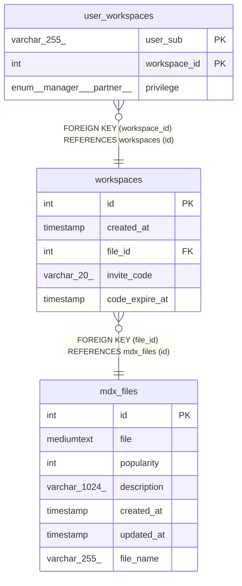

# workspaces

## Description

<details>
<summary><strong>Table Definition</strong></summary>

```sql
CREATE TABLE `workspaces` (
  `id` int NOT NULL AUTO_INCREMENT,
  `created_at` timestamp NULL DEFAULT CURRENT_TIMESTAMP,
  `file_id` int NOT NULL,
  `invite_code` varchar(20) COLLATE utf8mb4_general_ci DEFAULT NULL,
  `code_expire_at` timestamp NULL DEFAULT NULL,
  PRIMARY KEY (`id`),
  UNIQUE KEY `invite_code` (`invite_code`),
  KEY `file_id` (`file_id`),
  CONSTRAINT `workspaces_ibfk_1` FOREIGN KEY (`file_id`) REFERENCES `mdx_files` (`id`)
) ENGINE=InnoDB DEFAULT CHARSET=utf8mb4 COLLATE=utf8mb4_general_ci
```

</details>

## Columns

| Name | Type | Default | Nullable | Extra Definition | Children | Parents | Comment |
| ---- | ---- | ------- | -------- | ---------------- | -------- | ------- | ------- |
| id | int |  | false | auto_increment | [user_workspaces](user_workspaces.md) |  |  |
| created_at | timestamp | CURRENT_TIMESTAMP | true | DEFAULT_GENERATED |  |  |  |
| file_id | int |  | false |  |  | [mdx_files](mdx_files.md) |  |
| invite_code | varchar(20) |  | true |  |  |  |  |
| code_expire_at | timestamp |  | true |  |  |  |  |

## Constraints

| Name | Type | Definition |
| ---- | ---- | ---------- |
| invite_code | UNIQUE | UNIQUE KEY invite_code (invite_code) |
| PRIMARY | PRIMARY KEY | PRIMARY KEY (id) |
| workspaces_ibfk_1 | FOREIGN KEY | FOREIGN KEY (file_id) REFERENCES mdx_files (id) |

## Indexes

| Name | Definition |
| ---- | ---------- |
| file_id | KEY file_id (file_id) USING BTREE |
| PRIMARY | PRIMARY KEY (id) USING BTREE |
| invite_code | UNIQUE KEY invite_code (invite_code) USING BTREE |

## Relations



---

> Generated by [tbls](https://github.com/k1LoW/tbls)
